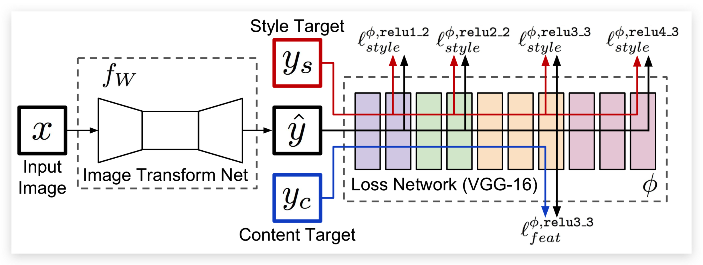
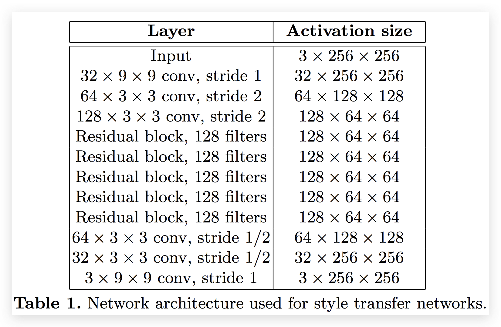
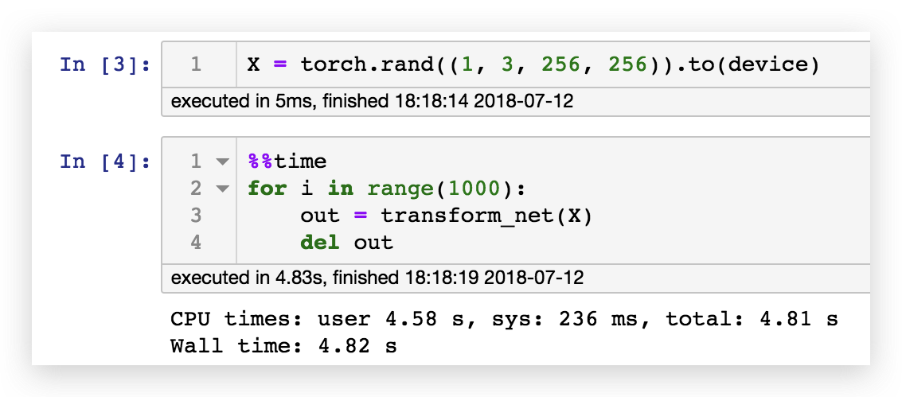
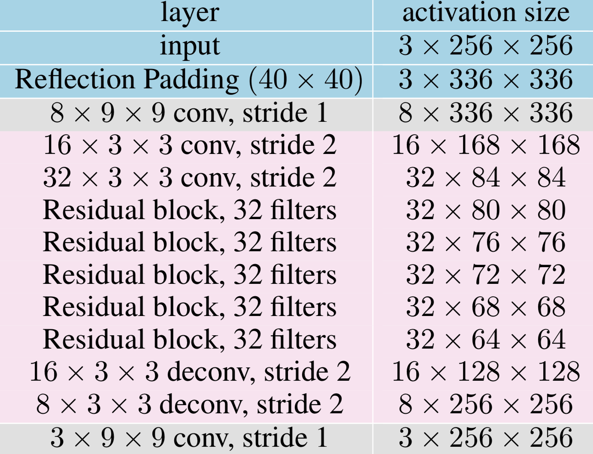
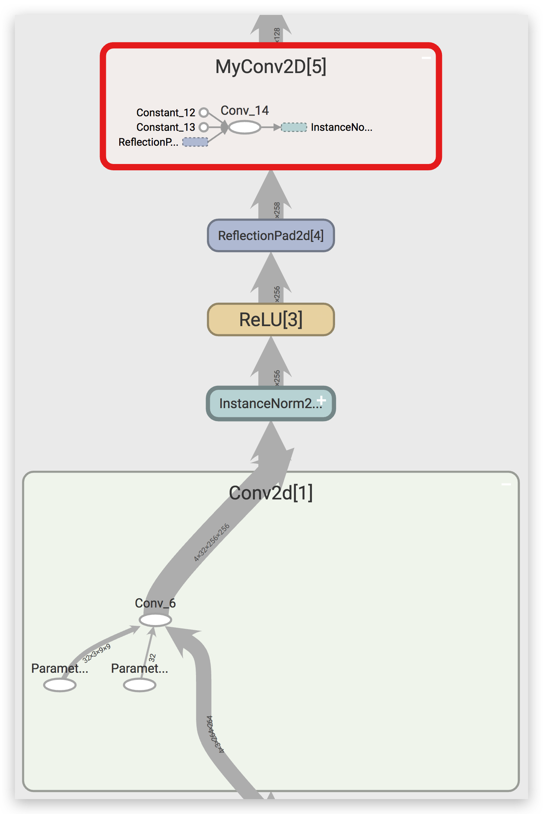
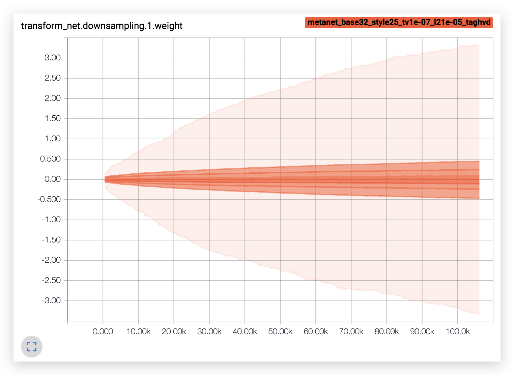
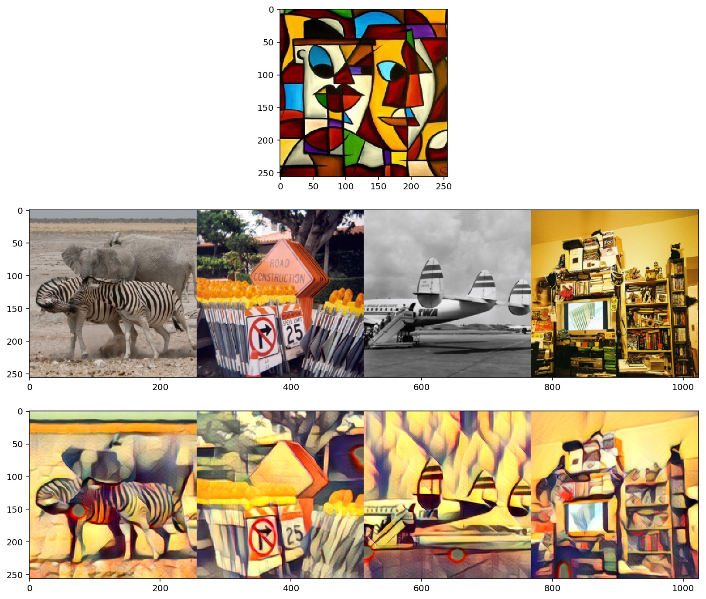
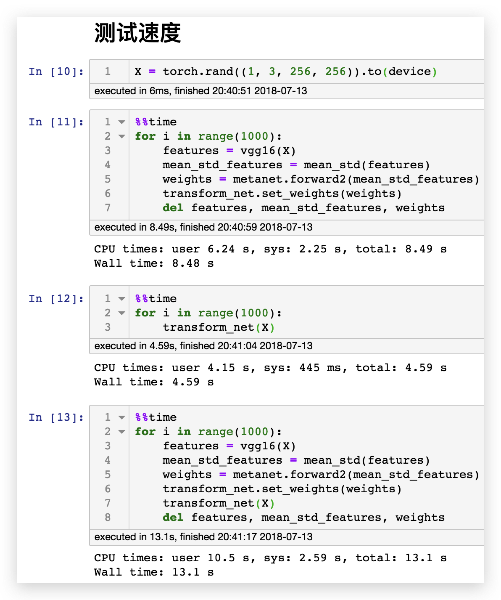

# StyleTransferTrilogy

# 风格迁移三部曲

风格迁移是一个很有意思的任务，通过风格迁移可以使一张图片保持本身内容大致不变的情况下呈现出另外一张图片的风格。本文会介绍以下三种风格迁移方式以及对应的代码实现：

* 固定风格固定内容的普通风格迁移（[A Neural Algorithm of Artistic Style](https://arxiv.org/abs/1508.06576)）
* 固定风格任意内容的快速风格迁移（[Perceptual Losses for Real-Time Style Transfer and Super-Resolution](https://arxiv.org/abs/1603.08155)）
* 任意风格任意内容的极速风格迁移（[Meta Networks for Neural Style Transfer](https://arxiv.org/abs/1709.04111)）

本文所使用的环境是 pytorch 0.4.0，如果你使用了其他的版本，稍作修改即可正确运行。

# 固定风格固定内容的普通风格迁移

最早的风格迁移就是在固定风格、固定内容的情况下做的风格迁移，这是最慢的方法，也是最经典的方法。

最原始的风格迁移的思路很简单，把图片当做可以训练的变量，通过优化图片来降低与内容图片的内容差异以及降低与风格图片的风格差异，迭代训练多次以后，生成的图片就会与内容图片的内容一致，同时也会与风格图片的风格一致。

## VGG16

VGG16 是一个很经典的模型，它通过堆叠 3x3 的卷积层和池化层，在 ImageNet 上获得了不错的成绩。我们使用在 ImageNet 上经过预训练的 VGG16 模型可以对图像提取出有用的特征，这些特征可以帮助我们去衡量两个图像的内容差异和风格差异。

在进行风格迁移任务时，我们只需要提取其中几个比较重要的层，所以我们对 pytorch 自带的预训练 VGG16 模型稍作了一些修改：

```py
class VGG(nn.Module):

    def __init__(self, features):
        super(VGG, self).__init__()
        self.features = features
        self.layer_name_mapping = {
            '3': "relu1_2",
            '8': "relu2_2",
            '15': "relu3_3",
            '22': "relu4_3"
        }
        for p in self.parameters():
            p.requires_grad = False
    
    def forward(self, x):
        outs = []
        for name, module in self.features._modules.items():
            x = module(x)
            if name in self.layer_name_mapping:
                outs.append(x)
        return outs

vgg16 = models.vgg16(pretrained=True)
vgg16 = VGG(vgg16.features[:23]).to(device).eval()
```

经过修改的 VGG16 可以输出 $\text{relu1_2、relu2_2、relu3_3、relu4_3}$ 这几个特定层的特征图。下面这两句代码就是它的用法：

```py
features = vgg16(input_img)
content_features = vgg16(content_img)
```

举个例子，当我们使用 vgg16 对 `input_img` 计算特征时，它会返回四个矩阵给 features，假设 `input_img` 的尺寸是 `[1, 3, 512, 512]`（四个维度分别代表 batch, channels, height, width），那么它返回的四个矩阵的尺寸就是这样的：

* relu1_2 `[1, 64, 512, 512]`
* relu2_2 `[1, 128, 256, 256]`
* relu3_3 `[1, 256, 128, 128]`
* relu4_3 `[1, 512, 64, 64]`

## 内容

我们进行风格迁移的时候，必须保证生成的图像与内容图像的内容一致性，不然风格迁移就变成艺术创作了。那么如何衡量两张图片的内容差异呢？很简单，通过 VGG16 输出的特征图来衡量图片的内容差异。



提示：在本方法中没有 Image Transform Net，为了表述方便，我们使用了第二篇论文中的图。

这里使用的损失函数是：

=\frac{1}{C_jH_jW_j}||\phi_j(\hat{y})-\phi_j(y)||^2_2$$)


其中：

* 是输入图像（也就是生成的图像）
* 是内容图像
*  代表 VGG16
*  在这里是 $\text{relu3_3}$
* )指的是 x 图像输入到 VGG 以后的第 j 层的特征图
* 是第 j 层输出的特征图的尺寸

根据生成图像和内容图像在 $\text{relu3_3}$ 输出的特征图的均方误差（MeanSquaredError）来优化生成的图像与内容图像之间的内容一致性。


那么写成代码就是这样的：

```py
content_loss = F.mse_loss(features[2], content_features[2]) * content_weight
```

因为我们这里使用的是经过在 ImageNet 预训练过的 VGG16 提取的特征图，所以它能提取出图像的高级特征，通过优化生成图像和内容图像特征图的 mse，可以迫使生成图像的内容与内容图像在 VGG16 的 relu3\_3 上输出相似的结果，因此生成图像和内容图像在内容上是一致的。

## 风格

### Gram 矩阵

那么如何衡量输入图像与风格图像之间的内容差异呢？这里就需要提出一个新的公式，Gram 矩阵：

$$\Large{G^\phi_j(x)_{c,c'}=\frac{1}{C_jH_jW_j} \sum_{h=1}^{H_j} \sum_{w=1}^{W_j} \phi_j(x)_{h,w,c}\phi_j(x)_{h,w,c'}}$$

其中：

* $\hat{y}$是输入图像（也就是生成的图像）
* $y$是风格图像
* $C_j\times H_j\times W_j$是第 j 层输出的特征图的尺寸。
* $G^\phi_j(x)$指的是 x 图像的第 j 层特征图对应的 Gram 矩阵，比如 64 个卷积核对应的卷积层输出的特征图的 Gram 矩阵的尺寸是 $(64, 64)$。
* $G^\phi_j(x)_{c,c'}$ 指的是 Gram 矩阵第 $(c, c')$ 坐标对应的值。
* $\phi_j(x)$指的是 x 图像输入到 VGG 以后的第 j 层的特征图，$\phi_j(x)_{h,w,c}$ 指的是特征图 $(h,w,c)$坐标对应的值。

Gram 矩阵的计算方法其实很简单，Gram 矩阵的 $(c, c')$ 坐标对应的值，就是特征图的第 $c$ 张和第 $c'$ 张图对应元素相乘，然后全部加起来并且除以 $C_j\times H_j\times W_j$ 的结果。根据公式我们可以很容易推断出 Gram 矩阵是对称矩阵。

具体到代码，我们可以写出下面的函数：

```py
def gram_matrix(y):
    (b, ch, h, w) = y.size()
    features = y.view(b, ch, w * h)
    features_t = features.transpose(1, 2)
    gram = features.bmm(features_t) / (ch * h * w)
    return gram
```

参考链接：

[https://github.com/pytorch/examples/blob/0.4/fast_neural_style/neural_style/utils.py#L21-L26](https://github.com/pytorch/examples/blob/0.4/fast_neural_style/neural_style/utils.py#L21-L26)

假设我们输入了一个 `[1, 3, 512, 512]` 的图像，下面就是各个矩阵的尺寸：

* relu1_2 `[1, 64, 512, 512]`，gram `[1, 64, 64]`
* relu2_2 `[1, 128, 256, 256]`，gram `[1, 128, 128]`
* relu3_3 `[1, 256, 128, 128]`，gram `[1, 256, 256]`
* relu4_3 `[1, 512, 64, 64]`，gram `[1, 512, 512]`

### 风格损失

根据生成图像和风格图像在 $\text{relu1_2、relu2_2、relu3_3、relu4_3}$ 输出的特征图的 Gram 矩阵之间的均方误差（MeanSquaredError）来优化生成的图像与风格图像之间的风格差异：

$$\Large\ell^{\phi,j}_{style}(\hat{y},y)=||G^\phi_j(\hat{y})-G^\phi_j(y)||^2_F$$

其中：

* $\hat{y}$是输入图像（也就是生成的图像）
* $y$是风格图像
* $G^\phi_j(x)$指的是 x 图像的第 j 层特征图对应的 Gram 矩阵

那么写成代码就是下面这样：

```py
style_grams = [gram_matrix(x) for x in style_features]

style_loss = 0
grams = [gram_matrix(x) for x in features]
for a, b in zip(grams, style_grams):
    style_loss += F.mse_loss(a, b) * style_weight
```

## 训练

那么风格迁移的目标就很简单了，直接将两个 loss 按权值加起来，然后对图片优化 loss，即可优化出既有内容图像的内容，也有风格图像的风格的图片。代码如下：

```py
input_img = content_img.clone()
optimizer = optim.LBFGS([input_img.requires_grad_()])
style_weight = 1e6
content_weight = 1

run = [0]
while run[0] <= 300:
    def f():
        optimizer.zero_grad()
        features = vgg16(input_img)
        
        content_loss = F.mse_loss(features[2], content_features[2]) * content_weight
        style_loss = 0
        grams = [gram_matrix(x) for x in features]
        for a, b in zip(grams, style_grams):
            style_loss += F.mse_loss(a, b) * style_weight
        
        loss = style_loss + content_loss
        
        if run[0] % 50 == 0:
            print('Step {}: Style Loss: {:4f} Content Loss: {:4f}'.format(
                run[0], style_loss.item(), content_loss.item()))
        run[0] += 1
        
        loss.backward()
        return loss
    
    optimizer.step(f)
```

此处使用了 LBFGS，所以 loss 需要包装在一个函数里，代码参考了：
[https://pytorch.org/tutorials/advanced/neural\_style\_tutorial.html](https://pytorch.org/tutorials/advanced/neural_style_tutorial.html)

## 效果

最终效果如图所示：


可以看到生成的图像既有风格图像的风格，也有内容图像的内容，很完美。不过生成一幅256x256 的图像在 1080ti 上需要18.6s，这个时间挺长的，谈不上实时性，因此我们可以来看看第二篇论文中的方法。

# 固定风格任意内容的快速风格迁移

有了上面的铺垫，理解固定风格任意内容的快速风格迁移就简单很多了。思路很简单，就是先搭建一个转换网络，然后通过优化转换网络的权值来实现快速风格迁移。由于这个转换网络可以接受任意图像，所以这是任意内容的风格迁移。

## 模型

模型结构很简单，分为三个部分：

* 降维，三层卷积层，逐渐提升通道数为128，并且通过 stride 把特征图的宽高缩小为原来的八分之一
* 5个 ResidualBlock 堆叠
* 升维，三层卷积层，逐渐降低通道数为3，并且通过 nn.Upsample 把特征图的宽高还原为原来的大小

先降维再升维是为了减少计算量，中间的 5 个 Residual 结构可以学习如何在原图上添加少量内容，改变原图的风格。下面让我们来看看代码。

### ConvLayer

```py
def ConvLayer(in_channels, out_channels, kernel_size=3, stride=1, 
    upsample=None, instance_norm=True, relu=True):
    layers = []
    if upsample:
        layers.append(nn.Upsample(mode='nearest', scale_factor=upsample))
    layers.append(nn.ReflectionPad2d(kernel_size // 2))
    layers.append(nn.Conv2d(in_channels, out_channels, kernel_size, stride))
    if instance_norm:
        layers.append(nn.InstanceNorm2d(out_channels))
    if relu:
        layers.append(nn.ReLU())
    return layers
```

首先我们实现了一个函数，ConvLayer，它包含：

* [nn.Upsample](https://pytorch.org/docs/stable/nn.html#upsample)（可选）
* [nn.ReflectionPad2d](https://pytorch.org/docs/stable/nn.html#reflectionpad2d)
* [nn.Conv2d](https://pytorch.org/docs/stable/nn.html#conv2d)
* [nn.InstanceNorm2d](https://pytorch.org/docs/stable/nn.html#instancenorm2d)（可选）
* [nn.ReLU](https://pytorch.org/docs/stable/nn.html#relu)（可选）

因为每个卷积层前后都可能会用到这些层，为了简化代码，我们将它写成一个函数，返回这些层用于搭建模型。

### ResidualBlock

```py
class ResidualBlock(nn.Module):
    def __init__(self, channels):
        super(ResidualBlock, self).__init__()
        self.conv = nn.Sequential(
            *ConvLayer(channels, channels, kernel_size=3, stride=1), 
            *ConvLayer(channels, channels, kernel_size=3, stride=1, relu=False)
        )

    def forward(self, x):
        return self.conv(x) + x
```

这里写的就不是函数，而是一个类，因为它内部包含许多层，而且并不是简单的自上而下的结构（Sequential），而是有了跨层的连接（`self.conv(x) + x`），所以我们需要继承 nn.Module，实现 forward 函数，才能实现跨层连接。

### TransformNet

最后这个模型就很简单了，照着论文里给出的表格搭建即可。我们这里为了实验方便，添加了 base 参数，当 `base=8` 时，卷积核的个数是按 `8, 16, 32` 递增的，当 `base=32` 时，卷积核个数是按 `32, 64, 128` 递增的。有了这个参数，我们可以按需增加模型规模，base 越大，图像质量越好。



```py
class TransformNet(nn.Module):
    def __init__(self, base=32):
        super(TransformNet, self).__init__()
        self.downsampling = nn.Sequential(
            *ConvLayer(3, base, kernel_size=9), 
            *ConvLayer(base, base*2, kernel_size=3, stride=2), 
            *ConvLayer(base*2, base*4, kernel_size=3, stride=2), 
        )
        self.residuals = nn.Sequential(*[ResidualBlock(base*4) for i in range(5)])
        self.upsampling = nn.Sequential(
            *ConvLayer(base*4, base*2, kernel_size=3, upsample=2),
            *ConvLayer(base*2, base, kernel_size=3, upsample=2),
            *ConvLayer(base, 3, kernel_size=9, instance_norm=False, relu=False),
        )
    
    def forward(self, X):
        y = self.downsampling(X)
        y = self.residuals(y)
        y = self.upsampling(y)
        return y
```

## 数据

训练的时候，我们使用了 COCO train 2014、val2014、test2014， 一共有 164k 图像，实际上原论文只用了训练集（80k）。图像宽高都是256。

> We resize each of the 80k training images to 256 × 256 and train our networks with a batch size of 4 for 40,000 iterations, giving roughly two epochs over the training data.

```py
batch_size = 4
width = 256

data_transform = transforms.Compose([
    transforms.Resize(width), 
    transforms.CenterCrop(width), 
    transforms.ToTensor(), 
    tensor_normalizer, 
])

dataset = torchvision.datasets.ImageFolder('/home/ypw/COCO/', transform=data_transform)
data_loader = torch.utils.data.DataLoader(dataset, batch_size=batch_size, shuffle=True)
```

返回：

```
Dataset ImageFolder
    Number of datapoints: 164062
    Root Location: /home/ypw/COCO/
    Transforms (if any): Compose(
                             Resize(size=256, interpolation=PIL.Image.BILINEAR)
                             CenterCrop(size=(256, 256))
                             ToTensor()
                             Normalize(mean=[0.485, 0.456, 0.406], std=[0.229, 0.224, 0.225])
                         )
    Target Transforms (if any): None
```

其中的 `tensor_normalizer` 是为了使用 pytorch 自带的预训练模型，在官方文档中提到了要进行预处理：[https://pytorch.org/docs/master/torchvision/models.html](https://pytorch.org/docs/master/torchvision/models.html)

```py
cnn_normalization_mean = [0.485, 0.456, 0.406]
cnn_normalization_std = [0.229, 0.224, 0.225]
tensor_normalizer = transforms.Normalize(mean=cnn_normalization_mean, std=cnn_normalization_std)
```

## 训练

### 超参数

虽然[官方开源](https://github.com/jcjohnson/fast-neural-style/blob/master/doc/training.md)给出的 `style_weight` 是 5，但是我这里测试得并不理想，可能是不同的预训练权值、不同的预处理方式造成的差异，设置为 1e5 是比较理想的。

> We use Adam [51] with a learning rate of 1 × 10−3.

优化器使用了论文中提到的 Adam 1e-3。

> The output images are regularized with total variation regularization with a strength of between $1\times10^{-6}$ and $1\times10^{-4}$, chosen via cross-validation per style target.

`tv_weight` 感觉没有太大变化，所以按论文中给出的参考设置了 1e-6。

> train our networks with a batch size of 4 for 40,000 iterations

`batch_size` 按论文设置为了4。

由于我这里使用的图片变多了，所以为了保持和官方的训练 step 一致（40k），训练代数（epoch）设置为了1。

### TotalVariation

> Total Variation Regularization. To encourage spatial smoothness in the output image $\hat{y}$, we follow prior work on feature inversion [6,20] and super- resolution [48,49] and make use of total variation regularizer $\ell_{TV}(\hat{y})$.

论文中提到了一个 TV Loss，这是为了平滑图像。它的计算方法很简单：

$$\Large{V_\text{aniso}(y)=\sum_{i,j}|y_{i+1,j}-y_{i,j}|+|y_{i,j+1}-y_{i,j}|}$$

将图像水平和垂直平移一个像素，与原图相减，然后计算绝对值的和，就是 TotalVariation。

参考链接：[https://en.wikipedia.org/wiki/Total_variation_denoising](https://en.wikipedia.org/wiki/Total_variation_denoising)

### 代码

由于代码太长，这里只贴一些关键代码：

```py
for batch, (content_images, _) in pbar:
    optimizer.zero_grad()

    # 使用风格模型预测风格迁移图像
    content_images = content_images.to(device)
    transformed_images = transform_net(content_images)
    transformed_images = transformed_images.clamp(-3, 3)

    # 使用 vgg16 计算特征
    content_features = vgg16(content_images)
    transformed_features = vgg16(transformed_images)

    # content loss
    content_loss = content_weight * F.mse_loss(transformed_features[1], content_features[1])
    
    # total variation loss
    y = transformed_images
    tv_loss = tv_weight * (torch.sum(torch.abs(y[:, :, :, :-1] - y[:, :, :, 1:])) + 
    torch.sum(torch.abs(y[:, :, :-1, :] - y[:, :, 1:, :])))

    # style loss
    style_loss = 0.
    transformed_grams = [gram_matrix(x) for x in transformed_features]
    for transformed_gram, style_gram in zip(transformed_grams, style_grams):
        style_loss += style_weight * F.mse_loss(transformed_gram, 
                                                style_gram.expand_as(transformed_gram))

    # 加起来
    loss = style_loss + content_loss + tv_loss

    loss.backward()
    optimizer.step()
```

通过对 loss 的优化，进而约束模型输出与内容图像的内容相似、与风格图像风格相似的图像，从而得到一个可以较快速度输出风格迁移图像的模型。

## 效果

最终效果如图所示：


可以看到对于任意内容图片，转换网络都能转换为固定风格的图像。根据下面这段代码进行的测速，1080ti 可以在4.82秒内完成 1000 张图像的风格迁移，相当于207fps，可以说是具有了实时性：



但是整个模型的训练时间需要1小时54分钟，如果我们想做任意风格图像的风格迁移，这个时间几乎是不可接受的，因此让我们来看看第三篇论文的思路。

# 任意风格任意内容的极速风格迁移

首先我们先对三种情况进行总结：

## 情况1

$$\large{\min_I\left(\lambda_c||\mathbf{CP}(I;w_f)-\mathbf{CP}(I_c;w_f)||^2_2+
\lambda_s||\mathbf{SP}(I;w_f)-\mathbf{SP}(I_s;w_f)||^2_2\right)}$$

其中：

* $\mathbf{CP}$ 是内容损失函数
* $\mathbf{SP}$ 是风格损失函数
* $\lambda_c$ 是内容权重
* $\lambda_s$ 是风格权重
* $w_f$ 是VGG16的固定权值
* $I_s$ 是风格图像
* $I_c$ 是内容图像
* $I$ 是输入图像

那么通过对输入图像 $I$ 进行训练，我们能够得到固定风格、固定内容的风格迁移图像。

## 情况2

$$\large{\min_w\sum_{I_c}\left(\lambda_c||\mathbf{CP}(I_w;w_f)-\mathbf{CP}(I_c;w_f)||^2_2+
\lambda_s||\mathbf{SP}(I_w;w_f)-\mathbf{SP}(I_s;w_f)||^2_2\right)}$$

其中：

* $I_w$ 是生成图像，$I_w=\mathcal{N}(I_c;w)$，$\mathcal{N}$ 是图像转换网络
 
通过对权值的优化，我们可以得到一个快速风格迁移模型，它能够对任何内容图像进行风格转换，输出同一种风格的风格迁移图像。

## 情况3

$$\large{\min_\theta\sum_{I_c,I_s}\left(\lambda_c||\mathbf{CP}(I_{w_\theta};w_f)-\mathbf{CP}(I_c;w_f)||^2_2+
\lambda_s||\mathbf{SP}(I_{w_\theta};w_f)-\mathbf{SP}(I_s;w_f)||^2_2\right)}$$

* $\theta$ 是 $Meta\mathcal{N}$ 的权值
* $w_\theta$ 是转换网络的权值，$w_\theta=Meta\mathcal{N}(I_s;\theta)$，所以我们可以说转换网络的权值是 MetaNet 通过风格图像生成的。
* $I_{w_\theta}$ 是转换网络生成的图像，$I_{w_\theta}=\mathcal{N}(I_c;w_\theta)$

总的来说就是风格图像输入 $Meta\mathcal{N}$ 得到转换网络 $\mathcal{N}$，转换网络可以将任意内容图像进行转换。通过输入大量风格图像和内容图像 $\sum_{I_c,I_s}$，可以训练出能够产出期望权值的 $Meta\mathcal{N}$。该模型可以输入任意风格图像，输出情况2中的迁移模型，进而实现任意风格任意内容的风格迁移。

## 转换网络（TransformNet）



论文中的转换网络很有意思，粉色部分的权重是由 MetaNet 生成的，而灰色部分的权重则与 MetaNet 一起训练。由于这个模型的需求比较个性化，我们的代码需要一些技巧，下面让我们详细展开讨论。

### MyConv2D

转换网络的结构还是与之前的一样，但是为了调用方便，我们需要实现一个新的类，这个类和卷积层类似，但是权值和偏置都需要是常量。这是因为权值已经是 MetaNet 的输出，如果赋值为 TransformNet 的权值，那么这个计算图就断了，这不符合我们的预期，我们应该让 MetaNet 的输出继续参与计算图，直到计算出 loss，不然 MetaNet 的权值将不会更新。因此我们事先了一个新的类，MyConv2D。

为了体现两者的差异，我们使用 TensorBoard 进行了可视化：



从上图中可以看到，nn.Conv2d 内部有两个参数（ Paramter），这是可以参与训练参数，也就是说在 `loss.backward()` 的时候会计算对应的梯度。而 MyConv2D 里面的权值和偏置都是常量（Constant），不会计算相应的梯度。

代码如下：

```py
class MyConv2D(nn.Module):
    def __init__(self, in_channels, out_channels, kernel_size=3, stride=1):
        super(MyConv2D, self).__init__()
        self.weight = torch.zeros((out_channels, in_channels, kernel_size, kernel_size)).to(device)
        self.bias = torch.zeros(out_channels).to(device)
        
        self.in_channels = in_channels
        self.out_channels = out_channels
        self.kernel_size = (kernel_size, kernel_size)
        self.stride = (stride, stride)
    
    def forward(self, x):
        return F.conv2d(x, self.weight, self.bias, self.stride)
```

### ConvLayer

为了区分以下两种情况：

* 权值是是可训练的参数
* 权值由 MetaNet 给出

我们写出了下面的代码：

```py
def ConvLayer(in_channels, out_channels, kernel_size=3, stride=1, 
	upsample=None, instance_norm=True, relu=True, trainable=False):
    ......
    if trainable:
        layers.append(nn.Conv2d(in_channels, out_channels, kernel_size, stride))
    else:
        layers.append(MyConv2D(in_channels, out_channels, kernel_size, stride))
    ......
    return layers
```
 
很简单，当权值由 MetaNet 给出时，它是不参与训练的，我们设置 trainable=False，然后使用 MyConv2D 层。
 
### TransformNet

下面就直接贴代码了，模型结构按照上面论文中的图去搭就好。

```py
class TransformNet(nn.Module):
    def __init__(self, base=8):
        super(TransformNet, self).__init__()
        self.base = base
        self.downsampling = nn.Sequential(
            *ConvLayer(3, base, kernel_size=9, trainable=True), 
            *ConvLayer(base, base*2, kernel_size=3, stride=2), 
            *ConvLayer(base*2, base*4, kernel_size=3, stride=2), 
        )
        self.residuals = nn.Sequential(*[ResidualBlock(base*4) for i in range(5)])
        self.upsampling = nn.Sequential(
            *ConvLayer(base*4, base*2, kernel_size=3, upsample=2),
            *ConvLayer(base*2, base, kernel_size=3, upsample=2),
            *ConvLayer(base, 3, kernel_size=9, instance_norm=False, relu=False, trainable=True),
        )
    
    def forward(self, X):
        y = self.downsampling(X)
        y = self.residuals(y)
        y = self.upsampling(y)
        return y
    ....
```

`TransformNet(32)` 每一层对应的权重数量如下：

```
defaultdict(int,
            {'downsampling.5': 18496,
             'downsampling.9': 73856,
             'residuals.0.conv.1': 147584,
             'residuals.0.conv.5': 147584,
             'residuals.1.conv.1': 147584,
             'residuals.1.conv.5': 147584,
             'residuals.2.conv.1': 147584,
             'residuals.2.conv.5': 147584,
             'residuals.3.conv.1': 147584,
             'residuals.3.conv.5': 147584,
             'residuals.4.conv.1': 147584,
             'residuals.4.conv.5': 147584,
             'upsampling.2': 73792,
             'upsampling.7': 18464})
```

通过 TensorBoard，我们可以对模型结构进行可视化：


## MetaNet

那么我们怎么样才能获得 TransformNet 的权值呢？当然是输入风格图像的特征。

那么我们知道风格图像经过 VGG16 输出的 $\text{relu1_2、relu2_2、relu3_3、relu4_3}$ 尺寸是很大的，假设图像的尺寸是 `(256, 256)`，那么卷积层输出的尺寸分别是 `(64, 256, 256)、(128, 128, 128)、(256, 64, 64)、(512, 32, 32)`，即使取其 Gram 矩阵，`(64, 64)、(128, 128)、(256, 256)、(512, 512)` 也是非常大的。我们举个例子，假设使用 `512*512` 个特征来生成 147584 个权值（residual 层），那么这层全连接层的 w 就是 $512*512*147584=38688260096$ 个，假设 w 的格式是 float32，那么光是一个 w 就有 144GB 这么大，这几乎是不可实现的。那么第三篇论文就提到了一个方法，只计算每一个卷积核输出的内容的均值和标准差。

> We compute the mean and stand deviations of two feature maps of the style image and the transferred image as style features.

只计算均值和标准差，不计算 Gram 矩阵，这里的特征就变为了 $(64+128+256+512)*2=1920$ 维，明显小了很多。但是我们稍加计算即可知道，$1920*(18496+73856+147584*10+73792+18464)=3188060160$，假设是 float32，那么权值至少有 11.8GB，显然无法在一块 1080ti 上实现 MetaNet。那么作者又提出了一个想法，使用分组全连接层。

> The dimension of hidden vector is 1792 without specification. The hidden features are connected with the filters of each conv layer of the network in a group manner to decrease the parameter size, which means a 128 dimensional hidden vector for each conv layer.

意思就是隐藏层全连接层使用$14*128=1792$个神经元，这个14对应的就是 TransformNet 里面的每一层卷积层（downsampling2层，residual10层，upsampling2层），然后每一层卷积层的权值只连接其中的一小片128，那么整体结构参考下图：


如果看不清可以点击查看原图。

在经过重重努力之后，模型大小终于限制在 1GB 以内了。当 `base=32` 时，保存为 pth 文件的模型大小为 870MB。

下面是代码：

```py
class MetaNet(nn.Module):
    def __init__(self, param_dict):
        super(MetaNet, self).__init__()
        self.param_num = len(param_dict)
        self.hidden = nn.Linear(1920, 128*self.param_num)
        self.fc_dict = {}
        for i, (name, params) in enumerate(param_dict.items()):
            self.fc_dict[name] = i
            setattr(self, 'fc{}'.format(i+1), nn.Linear(128, params))
    
    def forward(self, mean_std_features):
        hidden = F.relu(self.hidden(mean_std_features))
        filters = {}
        for name, i in self.fc_dict.items():
            fc = getattr(self, 'fc{}'.format(i+1))
            filters[name] = fc(hidden[:,i*128:(i+1)*128])
        return filters
```

直接 print 模型：

```
MetaNet(
  (hidden): Linear(in_features=1920, out_features=1792, bias=True)
  (fc1): Linear(in_features=128, out_features=18496, bias=True)
  (fc2): Linear(in_features=128, out_features=73856, bias=True)
  (fc3): Linear(in_features=128, out_features=147584, bias=True)
  (fc4): Linear(in_features=128, out_features=147584, bias=True)
  (fc5): Linear(in_features=128, out_features=147584, bias=True)
  (fc6): Linear(in_features=128, out_features=147584, bias=True)
  (fc7): Linear(in_features=128, out_features=147584, bias=True)
  (fc8): Linear(in_features=128, out_features=147584, bias=True)
  (fc9): Linear(in_features=128, out_features=147584, bias=True)
  (fc10): Linear(in_features=128, out_features=147584, bias=True)
  (fc11): Linear(in_features=128, out_features=147584, bias=True)
  (fc12): Linear(in_features=128, out_features=147584, bias=True)
  (fc13): Linear(in_features=128, out_features=73792, bias=True)
  (fc14): Linear(in_features=128, out_features=18464, bias=True)
)
```

## 数据

> There are about 120k images in MS- COCO trainval set and about 80k images in the test set of WikiArt.

要想训练这么大的模型，那么就必须要海量的风格图像和内容图像。原论文依旧选择了 COCO 作为内容数据集。而风格数据集选择了 [WikiArt](https://www.kaggle.com/c/painter-by-numbers/data)，该数据集包含大量艺术作品，很适合作为风格迁移的风格图片。

> During training, each content image or style image is resized to keep the smallest dimension in the range [256, 480], and randomly cropped regions of size 256 × 256.

论文提到图像要先缩放到 [256, 480] 的尺寸，然后再随机裁剪为 256 × 256。

代码如下：

```py
data_transform = transforms.Compose([
    transforms.RandomResizedCrop(width, scale=(256/480, 1), ratio=(1, 1)), 
    transforms.ToTensor(), 
    tensor_normalizer
])

style_dataset = torchvision.datasets.ImageFolder('/home/ypw/WikiArt/', transform=data_transform)
content_dataset = torchvision.datasets.ImageFolder('/home/ypw/COCO/', transform=data_transform)
```

## 训练

### 超参数

> The weight of content loss is 1 while the weight of style loss is 250.

虽然论文里给出的 `style_weight` 是 250，但是我这里测试得并不理想，可能是不同的预训练模型、不同的预处理方式造成的差异，设置为 25 是比较理想的。

> We use Adam (Kingma and Ba 2014) with fixed learning rate 0.001 for 600k iterations without weight decay.

优化器使用了论文中提到的 Adam 1e-3。

> The transferred images are regularized with total variations loss with a strength of 10.

因为这篇论文的作者用的是 caffe，VGG16 的预训练权值与 pytorch 差异比较大，所以我这里的 `tv_weight` 没有设置为论文中的10，而是选择了 1e-4。

>  The batch size of content images is 8 and the meta network is trained for 20 iterations before changing the style image.

这里的 batch_size 很有意思，每次来8张内容图片，但是每当训练20个 batch 之后，换一张风格图片。这样做的目的是为了保证 TransformNet 能在每张风格图像上都收敛一段时间，切换图像又能保证 MetaNet 能够适应所有的风格图像。

### 代码

由于代码太长，这里也只贴一些关键代码：

```py
for batch, (content_images, _) in pbar:    
    # 每 20 个 batch 随机挑选一张新的风格图像，计算其特征
    if batch % 20 == 0:
        style_image = random.choice(style_dataset)[0].unsqueeze(0).to(device)
        style_features = vgg16(style_image)
        style_mean_std = mean_std(style_features)
    
    # 检查纯色
    x = content_images.cpu().numpy()
    if (x.min(-1).min(-1) == x.max(-1).max(-1)).any():
        continue
    
    optimizer.zero_grad()
    
    # 使用风格图像生成风格模型
    weights = metanet(mean_std(style_features))
    transform_net.set_weights(weights, 0)
    
    # 使用风格模型预测风格迁移图像
    content_images = content_images.to(device)
    transformed_images = transform_net(content_images)

    # 使用 vgg16 计算特征
    content_features = vgg16(content_images)
    transformed_features = vgg16(transformed_images)
    transformed_mean_std = mean_std(transformed_features)
    
    # content loss
    content_loss = content_weight * F.mse_loss(transformed_features[2], content_features[2])
    
    # style loss
    style_loss = style_weight * F.mse_loss(transformed_mean_std, 
                                           style_mean_std.expand_as(transformed_mean_std))
    
    # total variation loss
    y = transformed_images
    tv_loss = tv_weight * (torch.sum(torch.abs(y[:, :, :, :-1] - y[:, :, :, 1:])) + 
                            torch.sum(torch.abs(y[:, :, :-1, :] - y[:, :, 1:, :])))
    
    # 求和
    loss = content_loss + style_loss + tv_loss 
    
    loss.backward()
    optimizer.step()
```

这里有几点问题值得思考：

1. 如果内容图像是纯色的，那么权值会直接 nan，原因不明，为了避免这个问题，需要检查纯色，然后 continue 来避免 nan。
2. 权值会逐渐增大，目前没有比较好的解决方案。



## 效果

最终效果如图所示：



可以看到对于任意内容图片，转换网络都能转换为固定风格的图像。

根据下面这段代码进行的测速，1080ti 可以在8.48秒内对 1000 张风格图像产出风格迁移模型，相当于117fps。而风格迁移模型转换的速度也很快，达到了4.59秒，相当于217fps。假设我们每一帧都用不同的风格，转换1000张图片也只需要13.1秒，相当于76fps，可以说做到了实时任意风格任意内容的极速风格迁移。



# 总结

我们使用 pytorch 实现了以下三种风格迁移：

* 固定风格固定内容的普通风格迁移（[A Neural Algorithm of Artistic Style](https://arxiv.org/abs/1508.06576)）
* 固定风格任意内容的快速风格迁移（[Perceptual Losses for Real-Time Style Transfer and Super-Resolution](https://arxiv.org/abs/1603.08155)）
* 任意风格任意内容的极速风格迁移（[Meta Networks for Neural Style Transfer](https://arxiv.org/abs/1709.04111)）

首先第一篇论文打破了以往的思维定式：只有权值可以训练。它通过对图像进行训练实现了风格迁移。然后第二篇论文就比较正常，通过训练一个模型来实现风格迁移。第三篇论文就很神奇了，通过模型来生成权值，进而实现任意风格的风格迁移。不得不感谢这些走在科技前沿的科研工作者，给了我们许多新奇的思路。

